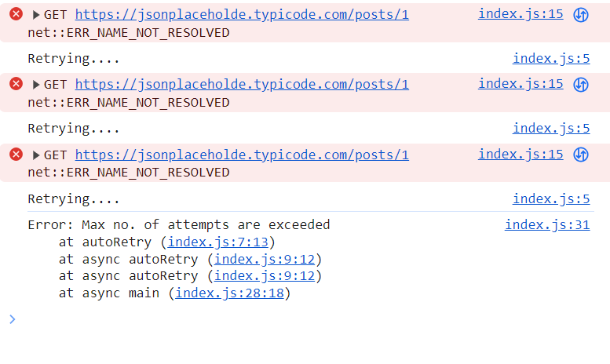

## fetch with autoRetry

**Approach Taken**

1. async function fetchWithAutoRetry takes two parameters: this function has try catch
2. 1st param is a function that performs the api call, 2nd param is the maxCount it can retry for
3. try will simply call the function (ex: return await fetchAPIURL())
4. catch will have 2 things, if count <=1 then throw new Error('Max retry exceeded')
5. recursively call the function with count-1 (ex: return await fetchWithAutoRetry(fetchResource, count - 1))
6. fetchResource function return fetch(url).then(res)=>{return res.json()}.then((data)=>{return data}).catch((err)=>{throw err})
7. million dollar question is fetchWithAutoRetry(()=>fetchAPIURL(url), maxCount).then(()=>{}).catch(()=>{})

```js
const autoRetry = async (fetchURLFunc, maxRetries) => {
  try {
    return await fetchURLFunc();
  } catch (error) {
    console.log('Retrying....');
    if (maxRetries <= 1) {
      throw new Error('Max no. of attempts are exceeded');
    }
    return await autoRetry(fetchURLFunc, maxRetries - 1);
  }
};

//fetch the api URL and return the data
const fetchURLFunc = async (URL) => {
  const response = await fetch(URL);
  if (!response.ok) {
    throw new Error(`Status ${response.status}`);
  }
  const data = await response.json();
  return data;
};

const maxRetries = 3;
const URL = 'https://jsonplaceholder.typicode.com/posts/1';

const main = async () => {
  try {
    const data = await autoRetry(() => fetchURLFunc(URL), maxRetries);
    console.log('Data Fetched', data);
  } catch (error) {
    console.log(error);
  }
};
main();
```
### Play with the URL, to get the desired below output 😉😉


