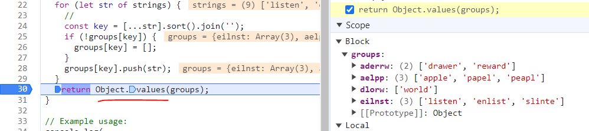

## Check if two strings are anagrams

<strong>Approach Taken using for loop :</strong>

1. if the `length of the two strings are not same`, return false
2. one `for loop for str1`, one `for loop for str2`
3. 1st for loop will iterate and calculate each and every character repeated. (ex: s: 1)
4. 2nd for loop will iterate and `see if this each and every character is already in the stored object or not`
5. Ex: if 'w' character is part of str2 `but not in the already stored object then directly return false`.
6. if the above condition is false then `keep on decrementing the char stored length` (ex: 's': 1 to 's': 0)
7. `at last return true` saying that passed args are anagrams.

```js
function areAnagrams(str1, str2) {
  if (str1.length !== str2.length) return false;

  const charCount = {};

  // loop through first string and store into an object (ex: charCount: {l: 1, i: 1, s: 1, t: 1, e:1, n: 1})
  for (let char of str1) {
    charCount[char] = (charCount[char] || 0) + 1;
  }

  // loop through second string and store into an object and decrement that charCount[char] (ex: charCount: {l: 1, i: 1, s: 1, t: 1, e:1, n: 1})
  for (let char of str2) {
    if (!charCount[char]) return false; // while looping through the second string, if any one of the character is not part of the already stored charCount object then simply return false
    charCount[char]--;
  }

  //this return true says that passed both of the strings are anagrams
  return true;
}

// Example usage:
console.log(areAnagrams('listen', 'silent')); // true
console.log(areAnagrams('hello', 'world')); // false
```

<ins>**Time Complexity**</ins>: O(n)

---

- **Approach taken for n number of anagrams**

1. custom sort for key generation (ex: listen will be sorted to eilnst and will be saved it as a key)
2. a for loop for all the strings, and each and every string will be passed to customSort func
3. if the groups object doesn't has the key groups[key] will be an empty array
4. if it has the key then just push the string (coming as input ex: listen, enlist)
5. if you don't want to see the ouptut as object then simply apply Object.values(your_object)

```js
// function customSort(str) {
//   let arr = [...str]; // Convert string to array

//   for (let i = 1; i < arr.length; i++) {
//     for (let j = i; j > 0; j--) {
//       if (arr[j] < arr[j - 1]) {
//         // Swap the characters without using any additional data structure
//         [arr[j], arr[j - 1]] = [arr[j - 1], arr[j]];
//       } else {
//         // If the left character is not greater than the right, then break
//         break;
//       }
//     }
//   }

//   return arr.join(''); // Convert array back to string
// }

function identifyAnagrams(...strings) {
  const groups = {};

  for (let str of strings) {
    //sort everything and convert back into string
    const key = [...str].sort().join('');
    // const key = customSort(str);
    //check if that key is already in the groups object
    if (!groups[key]) {
      //if key is not there then that key will be storing values in array format (ex: eilnst: ['listen', 'enlist'])
      groups[key] = [];
    }
    //we are pushing the values in the key (ex; refer above)
    groups[key].push(str);
  }
  //as we don't require the keys, we are simply extracting only values
  return Object.values(groups);
}

// Example usage:
console.log(
  identifyAnagrams(
    'listen',
    'enlist',
    'slinte',
    'apple',
    'papel',
    'peapl',
    'world',
    'drawer',
    'reward'
  )
);
```


**Time Complexity**:  O(n * m log m), 