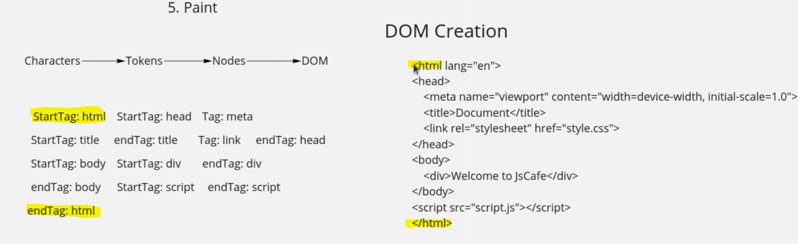
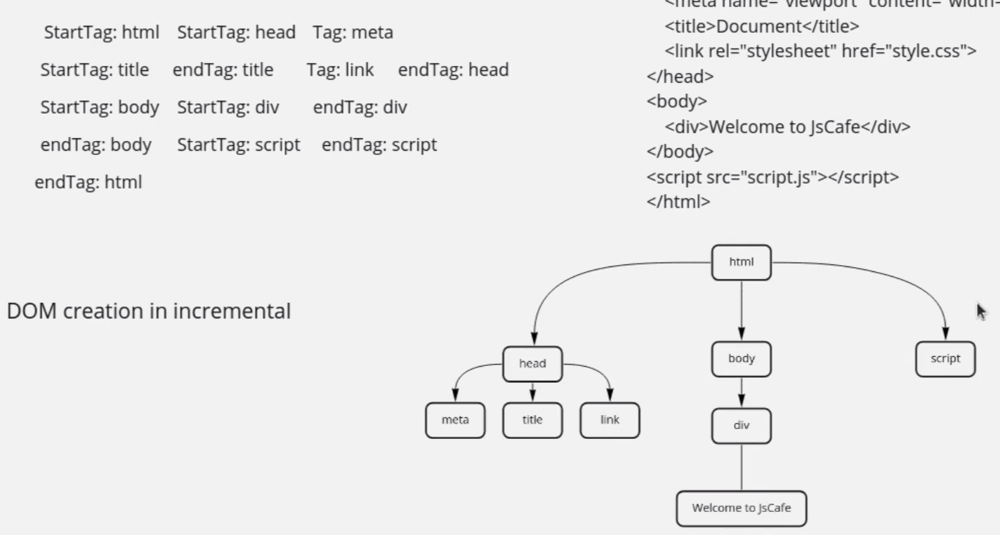

## Critical rendering path:

- The critical rendering path is the `sequence of steps that browser goes` through to `convert HTML, CSS, JS into pixels` on the screen.

- Optimizing Critical render path `improves render performance of a website`.

- The Critical Rendering path(CRP) **includes `Document Object Model(DOM)`, `CSS Object model (CSSOM)`, `render tree`, `layout` and `paint`**.

- The **_DOM is created <u>after HTML is parsed</u>_** and the HTML may request Javascript which may alter the DOM.

- The HTML makes requests to `styles`, which in turn **_<u>builds the CSSOM</u>_**.

- The **_<u>browser engine combines the two to create the Render tree</u>_**.

- `Layout` determines the `size and location of everything on the page`.
- Once the layout is determined, <u>pixels are painted on the screen</u>.

### Document Object Model (DOM)

- DOM `construction` is `incremental`
- The `HTML response` turns into `tokens` which in turns into `nodes` and this will turn into `DOM tree`.
- A `single DOM node` starts with a `startTag token` and ends with an `endTag token`.
- `Nodes are connected into a DOM tree based on token hierarchy`.
- If another set of startTag and endTags come between a set of startTag and endTags (`you have a node inside a node`)

**The greater the number of nodes, the longer the following events in the CRP will take**

 

---

#### CSS Object Model(CSSOM)

- When the DOM contains all the content of the page, the **_<u>CSSOM contains all the information on how to style the DOM</u>_**.

- CSSOM construction is `not Incremental` like **_DOM is incremental_**.

- **CSS is render blocking** - the _browser blocks page rendering_ <u>until it receives and process all the CSS</u>.

---

#### Creating the Render Tree:

- The Render Tree **is a combination of the DOM and CSSOM**.
- It **<u>includes all visible content (so not the content hidden with display: none) and the styles applied to it</u>**.

---

#### Layout (or Reflow):

- Once the Render Tree is built, the browser calculates the layout of each visible element.
- It figures out how much space each element takes and where it’s located on the screen.

---

#### Painting:

- Painting involves **filling in pixels**.
- It takes the layout from the previous step and paints in the pixels using the styles defined in the Render Tree.
- **_<u>This process can involve multiple layers</u>_**, especially in complex web applications or sites.

---

#### Compositing (in complex sites):

- If there are multiple layers due to overlapping elements, 3D transforms, or other factors, the browser needs to layer them correctly.
- This step **_<u>puts all those layers together into the final image that the user sees</u>_**.

---

### Questions on Critical Rendering Path (CRP):

#### Q1) How different resource types (like scripts, styles, and images) affect the rendering path?

---

#### Scripts(Javascript):

- **<u>Blocking Behavior:</u>**

  - By default, `<script>` tags are `"parser-blocking."`
  - When the browser's HTML parser encounters a `<script>` tag, **_<u>it stops parsing the HTML document</u> and must download (if the script is external) and execute the script before it can continue_**.
  - This is because the script might contain code that modifies the document's content.
     

- **<u> Async and Defer:</u>**

  - To mitigate the blocking behavior, we can use `async` and `defer` attributes.
  - Scripts with `async` **_are executed asynchronously_** as soon as they are available, whereas `defer` ensures the **_<u>scripts are executed in order and after the HTML is parsed</u>_**.
     

- **<u>DOM & CSSOM Dependency:</u>**
  - Scripts depend on the Document Object Model (DOM).
  - If a script tries to access/manipulate an element before it’s available, it can lead to errors.
  - Also, scripts might implicitly depend on the CSS Object Model (CSSOM) if they’re trying to compute styles or layout properties.

---

#### Styles (CSS):

- **<u>Render-blocking:</u>**

  - CSS is considered render-blocking.
  - Until the browser has requested, received, and parsed all CSS, **_it won’t start rendering the page_**.
  - This is **_<u>because the browser needs to ensure that the page’s content is styled correctly</u>_** from the start.
     

- **<u>CSSOM Construction:</u>**
  - **_<u>After receiving and parsing style information</u>_**, the browser constructs the CSS Object Model (CSSOM), which is required, along with the DOM, to construct the Render Tree (the visual representation of the page).

---

#### Images:

- **<u>Non-blocking:</u>**

  - **Images aren’t render-blocking** in the same way scripts or styles are.
  - If the browser encounters an image while parsing the HTML, **<u>it can continue constructing the DOM without waiting for the image to download</u>**.
     

- **<u>Reflow & Repaint:</u>**:
  - However, once the image is downloaded, **_if its actual dimensions differ from the specified dimensions_** (or if no dimensions are specified), **_<u>it can trigger a reflow (recalculation of layout) and repaint (redrawing of portions of the screen), which can impact performance</u>_**.
     
- **<u>Placeholder & Lazy Loading:</u>**
  - Sometimes, **_placeholders are used to hold the space for an image until it loads to prevent reflow_**. Additionally, “lazy loading” is a technique where images are only loaded when they’re about to be displayed in the viewport, improving initial page load times.

---

