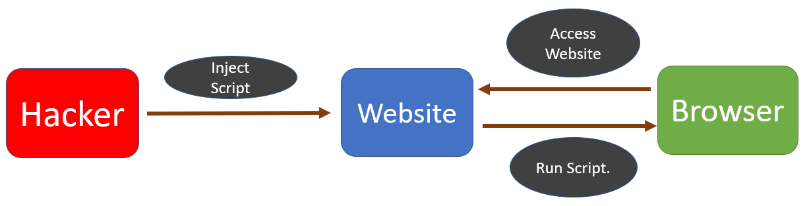
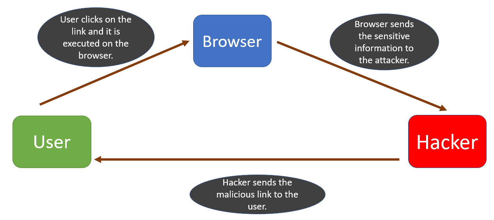

## What is Cross-site scripting(XSS) attacks?
- Also known as **`XSS`** attack, 
  - When a user **accesses** the website 
  - then **`they`** **accidentally** <ins>**run this malicious script**</ins>, compromising their data 
  - as the **`attacker` gets control** of the user’s browser.
 

- <ins>_XSS attacks exploit the browser’s trust of the **content received from the server**_.</ins>
 

- **Malicious scripts are executed by the victim’s browser** because the browser trusts the source of the content, even when it’s not coming from where it seems to be coming from.
 

-----

## Types of Cross-site Scripting Attack

### 1. Stored Cross Site Scripting attack:

- Most **`dangerous`** type of XSS attack, 
  - because it is very easy for the attacker <ins>**to inject the malicious script**</ins> through this method.
 

- This attack targets websites 
  - that **allow `user-input` and `store` it in the `database`.** (e.g. comments)
 

- Attacker writes the malicious script <ins>**inside the input box**</ins> (in the comment section)
  - When the attacker clicks on submit, the malicious script is <ins>**saved as the comment in the website database**</ins>.
  - When the user opens this website, the <ins>**script runs on the browser</ins> as soon as the comments load**.
 

#### This malicious script can attack the user through the following methods:

- Installing browser based **`Keyloggers`** <ins>**to capture keystrokes of the victim**</ins>.
 

- This is dangerous because the **attacker might use this <ins>to get access to our social media passwords**</ins> and also our credit card information.
 

- **`Capturing`** our session cookies (particularly our authentication session cookie). 
  - This cookie contains **`sessionID`** and **`tokens`** to verify the identity to the website without requiring a login to every page.
 

- Re-directing users to malicious websites.

### 2. Reflected Cross-Site Scripting attack:

- Attacker **tricks the user to click on the link** that contains the malicious script.
 

- The user may receive the malicious link through email, search results, or ads on another website.
 

- This script can steal browser data, such as cookies and send it to the attacker.
 

----

## Mitigation:
- If your team has been considering adding a CSP to your site, <ins>**_they’re a powerful tool for protecting against XSS and click-jacking_**</ins>, adding an additional layer of defense and improving your overall site security posture.
 
- <ins>A complete data transmission security strategy includes not only enforcing HTTPS for data transfer, but also marking all cookies with the `secure` attribute and providing automatic redirects from HTTP pages to their HTTPS counterparts</ins>.

---