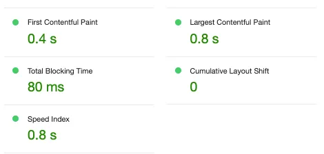

### Core Web Vitals

- Web vitals are set of metrics related to speed, responsiveness and visual stability, to help site owners measures user experience on the web and identify opportunities to improve.



- The current set of metric(s) focusses on three aspects of the user experience - **_loading, interactivity, visual stability_**


**1. Largest Contentful Paint (LCP):** measures loading performance of a page.

- To provide a good user experience, LCP should occur **_within 2.5 seconds_** of when the page first starts loading.
- LCP metric **_reports the render time of the largest image or text block visible within the viewport_**, relative to when the user first navigated to the page.
- Ex: As per google, a LCP of under 2.5 seconds for 75th percentile of users is considered as good.

**Example:** The LCP in the image below is 2.4 seconds which means that it took 2.4 seconds for the image to get visible to the user from the time user opened the page.


#### To optimize LCP, let’s discuss few best practices:

#### 1. <b><u>Server Side Rendering(SSR) with React:</u></b>

- Using frameworks like <u>**_Next.js for SSR can significantly improve LCP_**</u> by sending a <u>**_fully rendered page in response_**</u> to a browser request.
- In SSR, <u>**_the server pre-renders the HTML with data_**</u> before sending it to the browser in response to a request.
- When a user requests the page, <u>**_Next.js fetches the data on the server and renders the page_**</u> with the product data before sending it to the browser. This <u>**_results in a fully rendered HTML page being sent in response_**</u> to the browser request, <u>**_which can significantly improve LCP because there's no need for additional client side rendering_**.</u>

```js
//Server Side Rendering with Next.js

import React from 'react';

function HomePage({ products }) {
  return (
    <div>
      {products.map((product) => (
        <div key={product.id}>
          <h2>{product.name}</h2>
          <p>{product.description}</p>
        </div>
      ))}
    </div>
  );
}

export async function getServerSideProps() {
  //Fetch products from an API endpoint at build time or on each request
  const response = await fetch('https://api.example.com/products');
  const products = await response.json();

  return {
    props: { products },
  };
}
export default HomePage;
```

---

- Whereas **in Client Side Rendering**, the <u>**_browser initially receives an empty HTML shell_**</u>. Then <u>**_it needs to fetch data via Javascript and render the content on the client side_**.</u> This additional step <u>**_can delay the rendering of the largest contentful element_**</u>, leading to slower LCP times.

```js
// ProductList.js (Client-Side Rendering)
import React, { useEffect, useState } from 'react';

function ProductList() {
  const [products, setProducts] = useState([]);

  useEffect(() => {
    // Fetch products from an API endpoint
    fetch('/api/products')
      .then((response) => response.json())
      .then((data) => setProducts(data));
  }, []);

  return (
    <div>
      {products.map((product) => (
        <div key={product.id}>
          <h2>{product.name}</h2>
          <p>{product.description}</p>
        </div>
      ))}
    </div>
  );
}

export default ProductList;
```

---

#### 2. <b><u>Optimization of Images with 'srcset':</u></b>

- using responsive images ensures that only suitable image sizes are loaded on different devices.

```js
function ResponsiveImages() {
  return (
    
  );
}
```


#### 3. <b><u>Use React's memo for Pure components:</u></b>

- Prevents re-renders for the components that receive the same props

```js
const MyComponent = React.memo(AnotherComponent);
```

---

#### 4. <b><u> Optimize Images and Videos:</u></b>

- **Compress Images** Use image compression techniques to reduce the file size of the images without compromising quality. Tools like <u>**_ImageOptim, TinyPNG, Sqoosh_**</u> can help

- **Use Next-Gen Formats:**: Consider using next-generation image formats like <u>**WebP**</u>, which <u>**_provides better compression and quality_**</u> compared to older formats.

- **Lazy Load Images and Videos:**: Implement lazy loading for images and videos <u>**_to defer their loading until they are about to enter the viewport_**</u>, reduces the initial page load time.

```js
<!-- For Images -->


<!-- For Videos -->
<iframe src="video-source-url" loading="lazy"></iframe>
```

---

#### 5. <b><u> Minimize Render Blocking Resources:</u></b>

- Render blocking refers to any resources (Ex: Javascript or CSS) <u>**_that prevents the browser from rendering content to the screen_**</u>

- **Optimize CSS**: Minimize and concatenate CSS files to reduce the amount of render-blocking CSS. <u>**_Inline critical CSS or use asynchronous loading for non-critical styles_**.</u>

- **Defer JavaScript:**: <u>**_Load Javascript files asynchronously or defer them_**</u> to avoid blocking page rendering. Use modern Javascript bundling and minification techniques

```js
<script async src="index.js"></script>
<script defer src="index.js"></script>
```

```html
Example:

<!DOCTYPE html>
<html lang="en">
  <head>
    <meta charset="UTF-8" />
    <meta name="viewport" content="width=device-width, initial-scale=1.0" />
    <title>Async & Defer Example</title>

    <!-- Using async -->
    <script async src="1.js"></script>
    <script async src="2.js"></script>

    <!-- Using defer -->
    <!--
    <script defer src="1.js"></script>
    <script defer src="2.js"></script>
    -->
  </head>
  <body>
    <p>Content of the page...</p>
  </body>
</html>
```

<b><u>Explanation</u></b>:

**- With Async**: Both 1.js and 2.js are fetched in parallel with the HTML parsing.

- **_As soon as one of them is downloaded, it's executed right away_**
- This means <u>**_if 2.js finishes downloading before 1.js, 2.js will execute first_**.</u>

**- With Defer**:

- Both 1.js and 2.js are also fetched in parallel with the HTML parsing <u>**_but they will only be executed after the HTML is fully parsed_**</u> **_and they'll <u>execute in the order</u> they were defined_**.

- So, 1.js will always execute before 2.js

**- Execution Without async or defer**:

- Browser starts parsing the HTML document from top to bottom.
- When the browser <u>**_encounters a script tag(without async or defer)_**</u>, <u>**_it stops parsing the HTML_**</u>, it **_fetches the script_** (external), it **_executes the script_**
- After the script is executed, it resumes parsing and rendering the HTML.
- This process repeats for every subsequent script tag encountered.

---

#### 6. <b><u> Leverage Browser Caching and CDNs:</u></b>

**Leverage Browser Caching**:

- <u>**_Set appropriate cache headers_**</u> for your <u>**_static assets_** (e.g. images, scripts, stylesheets)</u> to reduce server requests for returning visitors.

```js
- Browser caching allows a web browser to locally store copies of static resources,
thereby speeding up subsequent page loads.

- Cache-Control: For how long, the individual response should be cached by the browser

- ETag(Entity Tag): When a resource changes, its ETag will also change,
informing the browser that a new version of the resource needs to be fetched.

- Expires: This header provides a date until which the resource is valid.

- Last-Modified: This header indicates when a resource was last modified.
```

**Content Delivery Network (CDN)**:

- <u>**_Distribute your content on global CDN to serve assets_**</u> from servers closer to users. reducing latency and improving loading times.

---

#### 7. <b><u> Prioritize Critical Resources:</u></b>

**- Critical Rendering Path**: Is all about identifying and prioritizing the resources that are most important for the initial rendering and interactivity of a webpage, especially the content that is immediately visible to the user.

```js
- Essential CSS for styling above-the-fold content.
- This refers to the minimal set of css needed to style the part of the web page that is visible to the user without scrolling.
- Optimizing and prioritizing the CSS means the browser can render this part of the page as quickly as possible.

- Inline or essential Javascript required for initial page interactivity.
- By focussing only on the Javascript necessary for the initial user interactions, you reduce the amount of code
the browser must process before the page becomes interactive.


- Critical images or media displayed above the fold. This involves identifying and prioritizing images or media content that appears.
- By ensuring these elements load quickly, the page appears to be fully loaded sooner from the users perspective.
- Even if other parts of the page like images or content below the fold are still loading.

```

#### 8. <b><u> Reduce Third Party Scripts:</u></b>

- **_Limit the no. of third-party scripts and services on your page_**. Each additional script can contribute to slower loading times.
- **_Consider using asynchronous or deferred loading_** for third party scripts to avoid blocking the page's rendering.

---

#### 9. <b><u> Optimize Fonts:</u></b>

- Minimize the no. of font requests <u>**_and use font display properties_**</u> to <u>**_control how fonts are displayed during loading_**</u>. Consider using system fonts for fallback to improve loading speed.

- 'woff2' (Web Open Font Format 2), which is a modern font format **_offering compact file sizes and quick load times_**.

- The value `swap` means that the browser should use a fallback font to display the text immediately and then swap it with the custom font (ex: 'Roboto' font) once it is fully downloaded.

- This is beneficial for performance and user experience because it ensures that the text is visible to users immediately, without waiting for the custom font to load, which can sometimes take a significant amount of time especially on slower connections.

```js
// This displays text immediately in a fallback font
// Once the custom font is loaded, it then "swaps" in:

@font-face{
  font-family: 'Roboto';
  src: url('Roboto.woff2') format('woff2');
  font-display: swap;
}
```

- Code snippet above is about loading a custom web font ('Roboto') with a strategy to ensure that text content is visible to users as soon as possible (using a fallback font) and then improving the visual appearance by swapping in the custom font once it's available.
- This approach is part of web performance optimization, particularly for improving the First Contentful Paint(FCP) and reducing the Cumulative Layout Shift(CLS) on web pages.

#### 10. <b><u> Optimize Images using Next.js:</u></b>

- Using the **_Image Component_** from **_next/image_**

**Automatic Optimization**: Images are optimized on the fly and served in modern formats like WebP when the browser suppports it.

**- Lazy Loading:** Images are loaded lazily by default, meaning they are only loaded when they come into the viewport.

**- Responsive**: The component automatically generates responsive sizes for images, ensuring faster load times on mobile and other devices.

```js
import Image from 'next/image'

function MyComponent(){
  return(
    <Image src="urlSource"
    alt="Description"
    width={500}
    height={300}
    >
  )
}

```

---

**You can read more about how to improve LCP here** — https://web.dev/articles/optimize-lcp

---

**2. First Input Delay (FID)**: measures interactivity.

- FID measures the time from when a user first interacts with a page (i.e, when they click a link, tap on a button, or use a custom, javascript powered control) to the time when the browser is actually able to begin processing event handlers in response to that interaction.

- To provide a good user experience, pages should have a FID of **_100 milliseconds_** or less

#### To improve FID, let's discuss few best practices.

**1. Debounce Event Listeners**:

- <u>**_Avoid processing every event_**</u>, especially if the event listener fires frequently like `resize` or `mousemove`

---

**2. Throttle Event handlers**:

- <u>**_Instead of handling every event like onScroll_**</u>, throttle them to improve responsiveness

---

You can read more about FID here — https://web.dev/articles/fid

**3. Offload tasks to Web Workers**:

- Utilize web workers to perform computations off the main thread.

```js
const worker = new Worker('worker.js');
worker.postMessage(data);
```

---

**4. Optimize Event Listeners:**:

```js
element.removeEventListener('click', handleClick);
```

---

**5. Minimize Javascript execution:**:

- Optimize and reduce the amount of JS code loaded and executed during the initial page load.

- **Implement Code Splitting**: to load only the necessary JS for the current view.
- Use **Tree shaking** and **minification techniques** to reduce the size of Javascript bundles.
- Tree shaking is a method of removing dead code from your bundles. For tree shaking to work effectively, Ensure that your package.json file has `sideEffects` property, which declares side-effect-free files.

- Below field provides information to the bundler(ex: Webpack) about which files in the package have side effects and it plays a crucial role in a process called tree-shaking, which is a form of dead-code eliminator.

- Side effects is something that affects <u>**_something outside the scope of the function being executed_**</u>. This includes, but is not limited to, modifying a global object, altering the DOM, making asynchronous API calls, and even modifying variables outside of the function's own scope.

```js
"name":"my-app"
"sideEffects": [
  "./src/sideEffectfulFile.js"
]

```

**Minification:**:

- Is the <u>**_process of removing all unnecessary characters from source code_**</u>, without changing its functionality.
- You can use plugins like <u>**_TerserPlugin_**</u> to minify the JS code.
  **entry**: Specifies the entry point of your application, which is the file where the bundling process starts.

**optimization: {minimizer: [new TerserPlugin()]}**:

- This section is for specifying optimization settings.
- The minimizer array here is <u>**_used to override the default minimization plugin_**</u> with `TerserPlugin`, <u>**_ensuring your javascript is minified for production_**.</u>

```js
const TerserPlugin = require('terser-webpack-plugin');

module.exports = {
  mode: 'production', //'production' mode enables tree shaking by default
  entry: './src/index.js',
  output: {
    filename: 'bundle.js',
    path: __dirname + '/dist',
  },
  module: {
    rules: [
      {
        test: /\.js$/,
        exclude: /node_modules/,
        use: {
          loader: 'babel-loader',
          options: {
            presets: ['@babel/preset-env'],
          },
        },
      },
    ],
  },
  optimization: {
    minimizer: [new TerserPlugin()], // Minify the code
  },
};
```

---

**6. Reduce Main Thread work:**:

- **_Profile and analyze JS execution on the main thread to identify long tasks_**.
- Consider <u>**_offloading CPU intensive tasks to Web workers_**</u> to free up the main thread for user interactions

---

**7. Optimize Images and Videos**:

- Compress and serve optimized images and videos to reduce their impact on page load time.

- Use responsive image techniques and lazy loading for below-the-fold media.

---

**8. Asynchronous Loading:**

- <u>**_Use it for assets that are not essential for the initial rendering_**.</u>
- **_<u>Load fonts asynchronously using the `font-display`</u> property_** to avoid blocking the main thread.

---

**9. Preconnect and Prefetch**:

- Use these <u>**_in your HTML to establish early connections to critical resources_**</u>

---

**_10. Optimize Server Response Time:_**:

- by optimizing server-side code and database queries.
- Use **_CDNs to serve assets_** efficiently.

---

**_11. Reduce Network Latency:_**:

- Optimize your website's hosting and <u>**_use CDNs to reduce network latency for users_**</u> in different geographic regions

---

**_13. Lazy loading of Images and Videos:_**:

- to defer their loading until there are close to entering the viewport, reducing the initial page load time.

---

**3. Cumulative Layout Shift (CLS)**: measures visual stability.


- CLS measures the unexpected shifting of web elements while the page is being rendered.
- This is very annoying for the users and sometimes can actually can do financial damage to users.

- For ex: If you look into the above GIF, the user actually intended to click on "No, go back" button but due to CLS the button which placed the order.

- To provide a user experience, pages should **_maintain a CLS of 0.1 or less_**

### To improve CLS, let's discuss few best practices

**_1. Size attribute for Images and Videos_**:

- **_Ensure that images and videos on your website have explicit width and height_** attributes defined in the HTML.
- This helps the **_browser allocate the correct space_** for these elements **_during page layout_**.

```js

```

---

**2. Lazy Loading Images:**

- Implement lazy loading for images and videos using the loading attribute. This defers the loading of below-the-fold images until they are close to entering the viewport, reducing layout shifts caused by late image loading.

---

**Note:** For each of the above metrics, to ensure you're hitting the recommended target for most of your users, a good threshold to measure is the **_75th percentile_** of page loads.

---

**3. Preload Critical Resources:**

- Use the preload or prefetch attributes to give the browser a hint about resources that will be needed in the future.
- **_Preloading critical resources like fonts, stylesheets, or scripts_** can reduce the likelihood of layout shifts caused by late-loading resources.

```js
<link rel="preload" href="font.woff2" as="font">
```

---

**4. Optimize Web Fonts:**

- **Web fonts can contribute to CLS** if they load and change the layout of text elements.
- Consider **using font-display strategies** to control font loading and reduce layout shifts.

---

**5. Using Placeholders for Content:**

- Display a skeleton or placeholder until the content is fully loaded.

```js
return data ? <div>{data.content}</div> : <div className='placeholder'></div>;
```

---

**6. Reserve Space for Lazy-loaded Images:**

If you’re lazy-loading images, reserve their space with appropriate placeholders.

```js
const img = new Image();
img.src = 'path/to/image.jpg';

img.onload = function () {
  placeholder.replaceWith(img);
};
```

---

**7. Avoid document.write:**

- Using document.write **can block the page and cause unexpected content shifts**.

```js
// Instead of document.write("<h1>Hello</h1>");
const h1 = document.createElement('h1');
h1.textContent = 'Hello';
document.body.appendChild(h1);
```

---

**8. Optimize CSS Animations:**

- Prefer properties like opacity and transform that don’t cause layout recalculations.

---

You can read more about CLS here — https://web.dev/articles/cls

---

Some more web vitals we should be aware of:

**First Contentful Paint (FCP)**:

- FCP measures how long it takes the browser to render the first piece of DOM content after a user navigates to your page.
- Images, non-white canvas elements, and SVGs on your page are considered DOM content; anything inside an iframe isn't included.

Read more about FCP here — https://web.dev/articles/fcp


---

**Interaction to Next Paint (INP):**

- INP is a metric that **_assesses a page's overall responsiveness to user interactions_** by observing the latency of all click, tap and keyboard interactions **_that occur throughout the lifespan of a user's visit to a page_**.

- The final INP value is the longest interaction observed, ignoring outliers.

- INP will soon replace FID as a core web vital.

---

**Time to First Bite (TTFB)**:

- TTFB is a metric that measures the time **_between the request for a resource_** and **_when the first byte of a response begins to arrive_**.

TTFB is the sum of:

- Redirect time
- Service Worked Startup time (if applicable)
- DNS lookup
- Connection and TLS negotiation
- Request, up until the point at which the first byte of the response has arrived.

---

**Total Blocking Time(TBT)**:

- The Total Blocking Time (TBT) metric measures the total amount of time after First Contentful Paint (FCP) where the main thread was blocked for long enough to prevent input responsiveness.


### Optimizing TBT:

**1. Reduce JavaScript Execution**:

- Consider code splitting, tree shaking, and only loading what’s necessary.

**2. Optimize Third-Party Scripts**

- Some third-party scripts can be very resource-intensive. Consider lazy-loading them, deferring them, or looking for lighter alternatives.

**3. Web Workers:**

- **_Use web workers for off-thread calculations_**. This allows running JavaScript without blocking the main thread.

---

**Speed Index**:

- Measure how quickly the page's content becomes visible to the user
- Is calculated <u>**_by capturing a video of the page load in a browser_**</u> and computing the visual progression between frames.
- Essentially it measures the average time at which visible parts of the page are displayed.


---

### Importance of Web Performance:

**- SEO**:

- Search Engines like Google, factor in site speed when ranking websites
- Faster websites are more likely to rank higher in search results, leading to increased visibility and organic traffic.

**- Accessibility**:

- Web performance also plays a role in making the web accessible to users with slow internet connections or older devices.

---

### General:

- An optimized website ensures inclusivity for all users, regardless of their tech capabilities.
- Faster websites provide better User experience.
- Delays in page loading or interactive responses can frustrate users, leading them to abandon the site.
- **_<u>Faster websites lead to higher conversion rates_**.</u>
- **_<u>Slow-loading websites have higher bounce rates_**</u>, meaning users leave before interacting with the site.
- Improved performance can reduce bounce rates, keeping users engaged for longer.
