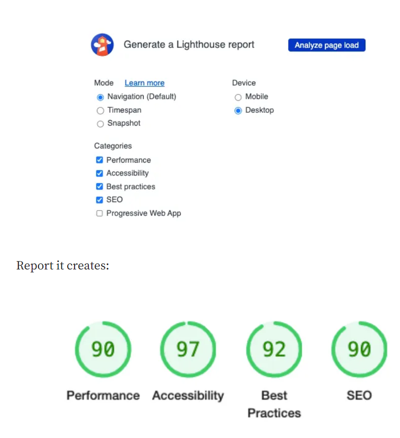
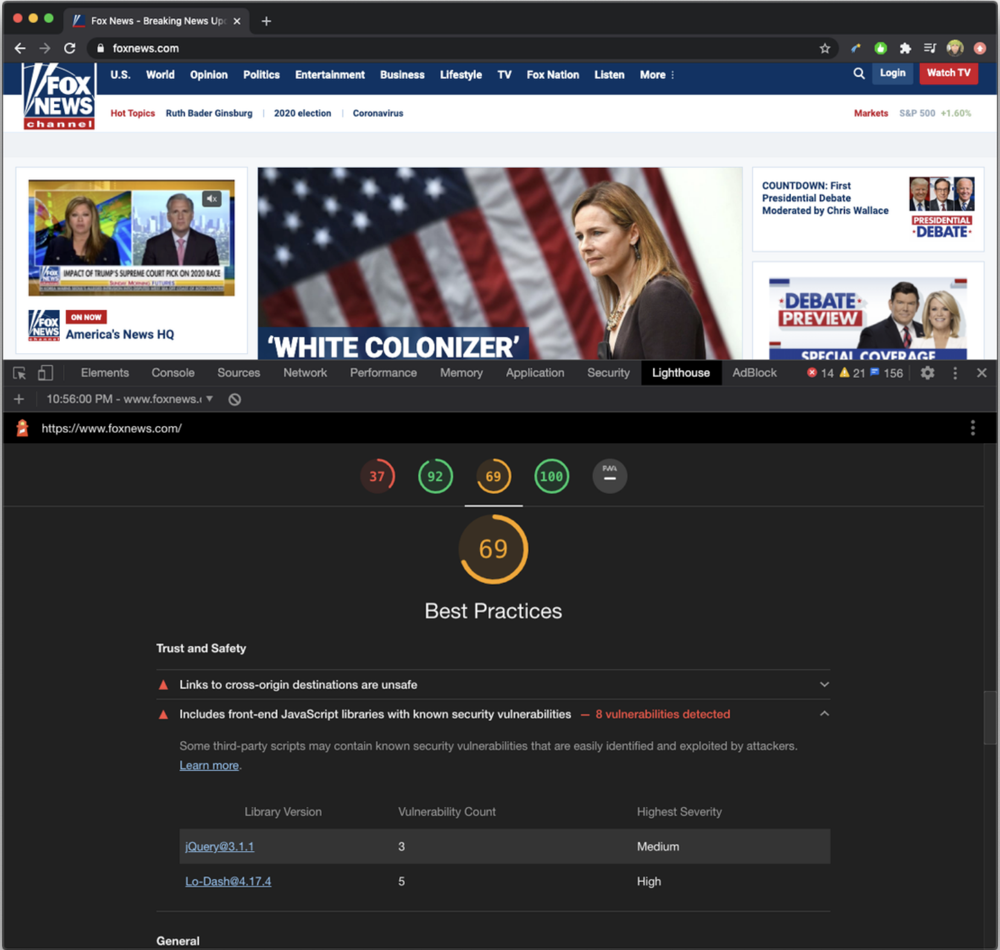

### LightHouse

- Is an open-source automated tool developed by Google **_for improving the quality of web pages_**.
- provides insights about web best practices for performance, accessibility, security.
- Measures the **_performance, accessibility, progressive web apps, SEO_** and more of web pages.
- **_Lighthouse can be run in the Chrome browser_**, from the command line, or as a Node module
- **_Various tools and libraries_** are available to help developers measure and optimize web vitals **_such as Google's Lighthouse, PageSpeed insights, GTMetrix and WebVitals Javascript libraries_**.

#### <ins>Key Features:</ins>
**1. Performance Metrics:** Lighthouse gives scores on metrics like First Contentful Paint (FCP), Speed Index, and Time to Interactive, helping devs to understand where their site stands in terms of user experience.
**2. Accessibility Checks**: It assesses the accessibility of a web page, pointing out areas that might be problematic for users with disabilities
**3. SEO Audits:** Lighthouse ensures your page is optimized for search engine results ranking
**4. PWA Audits**: For those interested in building Progressive Web Apps, Lighthouse checks the adherence to best practices.

----

- We can click on each item (ex: Best practices), which open the **Trust and Safety**

----

#### Q) Lighthouse is available with via chrome dev tools and helps with ?

#### *Finding performance issues*

#### *Finding security issues*

#### *Finding SEO and web accessibility issues*

#### *Finding issues with progressive web apps*

View Answer

